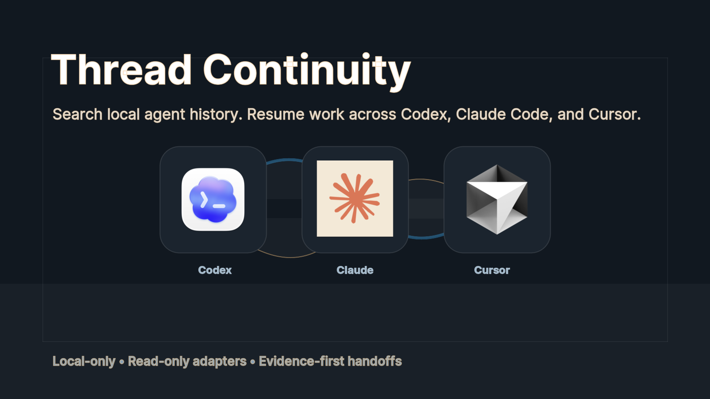

# Thread Continuity



Thread Continuity is a local-only continuity layer for finding prior agent work and producing compact resume packets across Codex, Claude Code, and Cursor.

## Value

Agent work gets scattered across harnesses, repos, and time. Thread Continuity gives a new agent a local evidence trail before it touches code: what thread mattered, where it happened, what the last known state was, what files or proofs were referenced, and what needs to be verified before continuing.

The product is intentionally boring in the best way: local index, read-only adapters, short cited snippets, and explicit stale-result warnings.

## What It Does

- Detects local Codex session sources, Claude Code session sources, Cursor composer storage, and optional `cass`.
- Indexes Codex, Claude Code, and Cursor sessions read-only into a local SQLite database.
- Searches with lexical SQLite FTS when available, with a LIKE fallback.
- Classifies query intent for resume, implementation, blocker, artifact, decision, and status lookups.
- Returns ranked candidates with workspace, source refs, status, confidence, staleness warnings, and short evidence snippets.
- Builds compact `thread_pack` output for continuing work without dumping full transcripts.

## Supported Sources

| Source | Status | Notes |
|---|---|---|
| Codex | Ingested | Reads local session JSONL and archived session JSONL. |
| Claude Code | Ingested | Reads local Claude Code project JSONL. |
| Cursor | Ingested | Reads local Cursor composer/bubble storage from `state.vscdb`. |
| Codex memory | Ingested | Reads local memory index and rollout summaries. |
| CASS | Detected | Falls back to native local indexing when unavailable. |

## What It Avoids

- No hosted sync.
- No browser cookies, credentials, or local storage reads.
- No model downloads or embeddings.
- No full transcript export in search results.
- No mutation of external services.

## MCP Tools

- `thread_triage()`
- `thread_sources_status()`
- `thread_index_status()`
- `thread_sources_add(path_or_profile, source_type, name?)`
- `thread_index(force?, source?, max_threads?)`
- `thread_search(query, workspace?, source?, limit?, mode?)`
- `thread_resume(query, workspace?, limit?)`
- `thread_pack(thread_id, focus?)`
- `thread_export(thread_id, focus?, format?, output_path?)`
- `thread_get(thread_id, include_messages?, include_outputs?)`
- `thread_sources_list()`
- `thread_explain_result(result_id)`
- `thread_open_ref(thread_id)`
- `thread_eval(limit?)`

## Local Smoke Commands

```bash
python3 -m unittest discover -s tests -v
python3 -m thread_continuity.cli triage
python3 -m thread_continuity.cli index --max-threads 20
python3 -m thread_continuity.cli index --source claude_code --max-threads 20
python3 -m thread_continuity.cli index --source cursor --max-threads 20
python3 -m thread_continuity.cli search "resume building thread continuity" --limit 5
python3 -m thread_continuity.cli eval --limit 5
```

If you have access to the Codex plugin validator, run it from your local validator path before packaging.

## Install For Local Use

The product is a local CLI plus MCP server. It is not a Mac app by default.

```bash
./scripts/install-local.sh
thread-continuity doctor
thread-continuity mcp-config --mode installed
thread-continuity index
thread-continuity resume "building X"
```

Development mode without installing:

```bash
python3 -m thread_continuity.cli doctor
python3 -m thread_continuity.cli mcp-config --mode source
```

See [DISTRIBUTION.md](DISTRIBUTION.md) for the run model and future packaging path.

## Runtime Paths

By default the plugin reads:

- `~/.codex/sessions/**/*.jsonl`
- `~/.codex/archived_sessions/**/*.jsonl`
- `~/.codex/memories/MEMORY.md`
- `~/.claude/projects/**/*.jsonl`
- `~/Library/Application Support/Cursor/User/globalStorage/state.vscdb`
- `~/Library/Application Support/Cursor/User/workspaceStorage/**/state.vscdb`

The SQLite index defaults to:

- `~/.codex/thread-continuity/index.sqlite3`

Tests and local runs can override paths with:

- `CODEX_SESSION_ROOT`
- `CODEX_ARCHIVED_SESSION_ROOT`
- `CODEX_MEMORY_ROOT`
- `CLAUDE_CODE_SESSION_ROOT`
- `CURSOR_GLOBAL_STORAGE_ROOT`
- `CURSOR_WORKSPACE_STORAGE_ROOT`
- `THREAD_CONTINUITY_DB`
- `THREAD_CONTINUITY_CONFIG`
- `THREAD_CONTINUITY_EXPORT_ROOT`

## PRD Trace

- Phase 0: CASS is detected and reported honestly. If unavailable, the plugin falls back to Codex-native indexing.
- Phase 1: Codex local JSONL indexing, SQLite FTS search, resume packets, MCP tools, and skill behavior are implemented.
- Phase 2: Claude Code local JSONL parsing and Cursor composer/bubble storage parsing are implemented.
- Phase 3: Local smoke eval, result explanation, staleness warnings, and redacted snippets are implemented as trust scaffolding.

## Privacy

Thread Continuity is local-only by default. It reads local transcript files, writes a local SQLite index, and does not upload transcripts, cookies, credentials, or browser storage.

## Graphics

The repo graphics live in [graphics](graphics). Composite images use locally installed Codex, Claude, and Cursor app icons to communicate supported local sources. Third-party app icons and names are trademarks of their respective owners.

## License

MIT. See [LICENSE](LICENSE).
